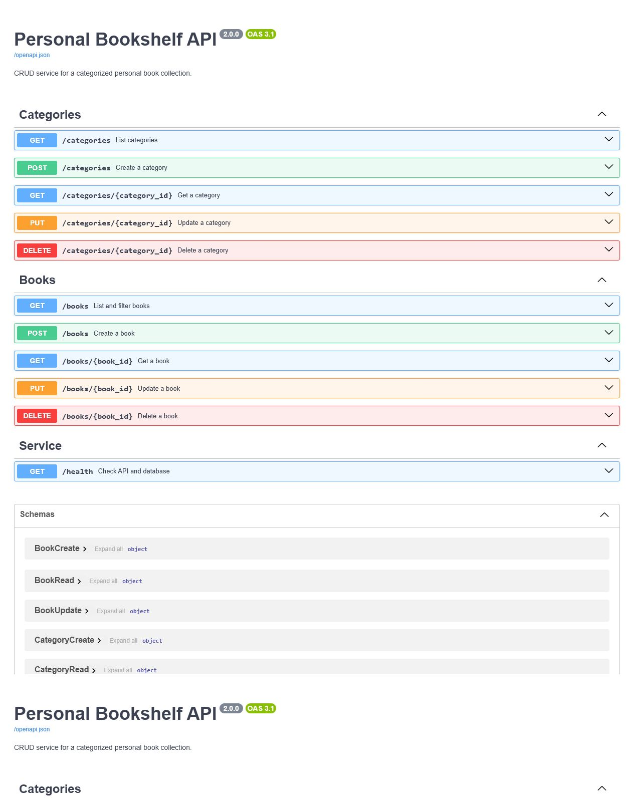
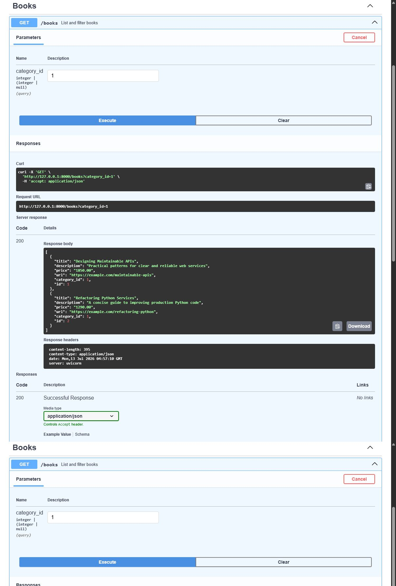
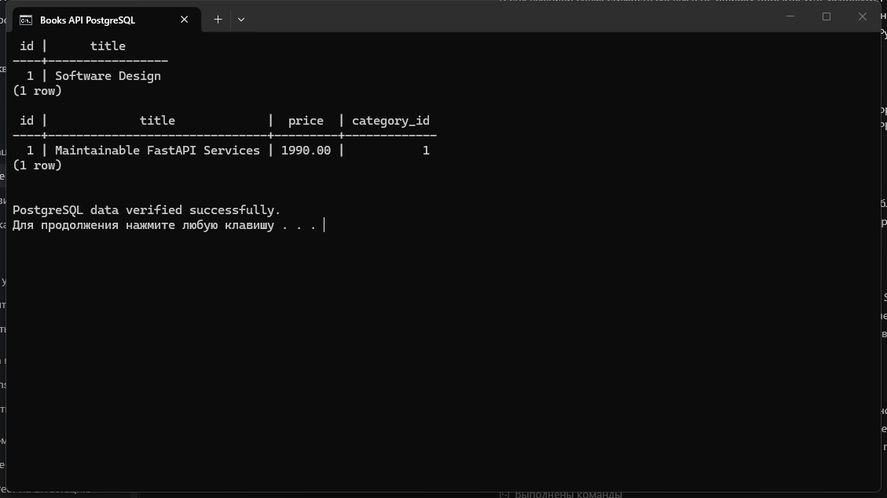

# Personal Bookshelf API

Учебный REST API для каталога книг. Приложение позволяет создавать категории,
добавлять в них книги, изменять и удалять записи, а также фильтровать книги по
категории. Данные сохраняются в PostgreSQL.

## Технологии

- Python 3.12+
- FastAPI и Uvicorn
- SQLAlchemy 2
- Pydantic 2
- PostgreSQL

## Подготовка базы данных

Создайте пользователя и базу в PostgreSQL:

```sql
CREATE USER octagon WITH PASSWORD '12345';
CREATE DATABASE octagon_db OWNER octagon;
```

Скопируйте пример настроек и при необходимости измените строку подключения:

```bash
cp .env.example .env
```

## Установка и запуск

```bash
python3 -m venv .venv
source .venv/bin/activate
pip install -r requirements.txt
python -m app.init_db
uvicorn app.main:app --reload
```

После запуска доступны:

- Swagger UI: http://127.0.0.1:8000/docs
- ReDoc: http://127.0.0.1:8000/redoc
- проверка API и БД: http://127.0.0.1:8000/health

## Эндпоинты

| Метод | Адрес | Назначение |
|---|---|---|
| `GET` | `/health` | Проверить API и подключение к БД |
| `GET` | `/categories` | Получить категории |
| `POST` | `/categories` | Создать категорию |
| `GET` | `/categories/{id}` | Получить категорию |
| `PUT` | `/categories/{id}` | Изменить категорию |
| `DELETE` | `/categories/{id}` | Удалить пустую категорию |
| `GET` | `/books` | Получить книги |
| `GET` | `/books?category_id=1` | Отфильтровать книги |
| `POST` | `/books` | Создать книгу |
| `GET` | `/books/{id}` | Получить книгу |
| `PUT` | `/books/{id}` | Изменить книгу |
| `DELETE` | `/books/{id}` | Удалить книгу |

Категорию с книгами удалить нельзя: API вернет `409 Conflict`. При создании и
изменении книги проверяется существование указанной категории.

## Тесты

```bash
pytest -q
```

## Подтверждение выполнения

Все изображения ниже получены при работе приложения с PostgreSQL.



| Проверка | Скриншот |
|---|---|
| `POST /categories` — `201 Created` | [01-post-category-201.png](examples/01-post-category-201.png) |
| `GET /categories` — `200 OK` | [02-get-categories-200.png](examples/02-get-categories-200.png) |
| `GET /categories/1` — `200 OK` | [03-get-category-200.png](examples/03-get-category-200.png) |
| `PUT /categories/1` — `200 OK` | [04-put-category-200.png](examples/04-put-category-200.png) |
| `POST /books` — `201 Created` | [05-post-book-201.png](examples/05-post-book-201.png) |
| `GET /books?category_id=1` — `200 OK` | [06-get-books-filter-200.png](examples/06-get-books-filter-200.png) |
| `GET /books/1` — `200 OK` | [07-get-book-200.png](examples/07-get-book-200.png) |
| `PUT /books/1` — `200 OK` | [08-put-book-200.png](examples/08-put-book-200.png) |
| `DELETE /books/2` — `204 No Content` | [09-delete-book-204.png](examples/09-delete-book-204.png) |
| `DELETE /categories/2` — `204 No Content` | [10-delete-category-204.png](examples/10-delete-category-204.png) |
| `GET /health` — `200 OK`, БД подключена | [11-get-health-200.png](examples/11-get-health-200.png) |
| `SELECT` из PostgreSQL | [12-postgresql-select.png](examples/12-postgresql-select.png) |

### Фильтрация книг



### Данные в PostgreSQL


